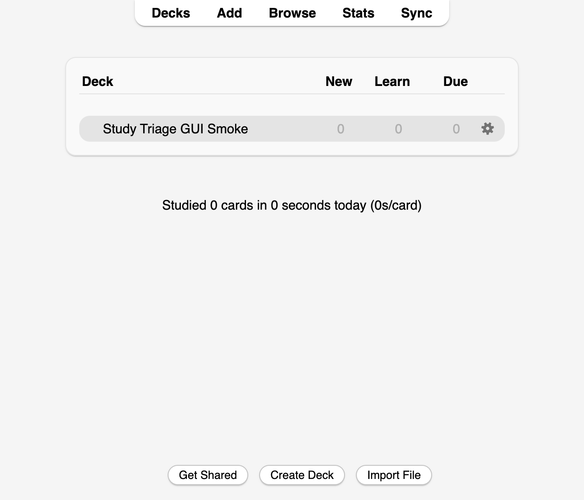

# Study Triage

[](https://ankiweb.net/shared/info/1850611434)
[](https://github.com/elvis-sik/anki-zero-today-new)


Study Triage is an Anki add-on that adds quick triage actions for days when you need to reduce today's study load.



## What it does

Use this on tired days when you want to do reviews only.

After installation, open:

- `Tools -> Study Triage`

Available collection-wide actions:

- `Set Today's New Cards to 0`
- `Answer Due Cards as Good`
- `Answer Due Cards as Easy`

Or click a deck's cog menu on the Decks screen and open:

- `Study Triage`

The same deck menu is also available by right-clicking a deck name on the Decks
screen. This is useful with deck-browser layout add-ons that hide Anki's cog
icon.

The deck-menu actions apply to that deck. Anki's deck search includes subdecks,
so answering due cards from a parent deck includes due cards in its children.
Filtered decks can use the Good/Easy actions; the new-card limit action is only
available for regular decks.

The new-card limit change is temporary. It uses Anki's `Today only` limit, so it
resets automatically on the next Anki day. Deck-cog Good/Easy actions answer the
queued due review and learning cards Anki's scheduler would currently show for
that deck, including review limits and sibling-burying behavior. Cards that
belong to the deck but are currently parked in another deck, such as a filtered
deck, are left alone. The actions show a count before running, process the batch
with progress, and try to group the change into a single Anki undo step.

## Install

Requires Anki 2.1.55 or newer.

### From AnkiWeb

1. In Anki, open `Tools -> Add-ons -> Get Add-ons...`.
2. Enter add-on code `1850611434`.
3. Restart Anki.
4. Run `Tools -> Study Triage`, use the deck cog menu, or right-click a deck name whenever you need to triage a deck.

AnkiWeb page: <https://ankiweb.net/shared/info/1850611434>

### From Source

1. Copy the folder contents into an Anki add-on folder such as `StudyTriage`.
2. Restart Anki.
3. Run `Tools -> Study Triage`, use the deck cog menu, or right-click a deck name whenever you need to triage a deck.

## Notes

- Filtered decks are skipped by the new-card limit action.
- The add-on uses the same deck-limit update path that the local `anki-fractional-scheduler` add-on uses to modify `Today only` new/day correctly.
- If Anki's newer deck-config API is unavailable, the add-on falls back to older deck update mechanisms.
- Large Good/Easy and all-deck new-limit batches are merged incrementally to
  stay inside Anki's undo-history window.
- If an action fails, the add-on shows failure details, offers to open failed cards in the Browser, and writes details to `user_files/study-triage.log` inside the add-on folder.

## Development

Run repository checks with:

```sh
make test
```

Run the disposable Anki GUI smoke test with:

```sh
make test-gui-smoke
```

The GUI smoke test uses `anki-workbench` from the PyPI
`anki-addon-workbench[gui]` package. It launches Anki with a temporary base
folder, installs this add-on plus the project-specific probe add-on, verifies
the Tools and deck-cog menu actions through Qt, checks the deck-name context
menu bridge, writes a JSON result, and quits. See
`tests/gui_smoke/README.md` for the Docker/Xvfb variant that keeps GUI activity
inside a virtual display.

For exploratory agent-driven GUI work, use:

```sh
uv run --extra dev anki-workbench launch --xvfb --keep
uv run --extra dev anki-workbench screenshot --out .tmp-gui-workbench/shot.png
```

The compatibility scripts in `scripts/` delegate to the installed
`anki-workbench` package for older commands.

## Release

The release path dogfoods the sibling `anki-addon-release` framework. Put
1Password item references in the git-ignored `.env` file:

```sh
cp .env.example .env
```

Then run:

```sh
make release
```

That resolves the references with `op read`, passes the resolved credentials
only to the child release process, logs in to AnkiWeb, builds the `.ankiaddon`,
fills the AnkiWeb form, and stops before the final save button. The prepared
browser stays open until you press Enter in the terminal.

Use `make release-login` to refresh the browser-profile login, or
`make release-publish` to refill the publish form after login is already valid.
The dedicated publishing-account pattern is documented in
[`anki-addon-release`](https://github.com/elvis-sik/anki-addon-release#separate-publishing-account).
If AnkiWeb says the dedicated account is too new, it is hitting AnkiWeb's
[new-account sharing guard](https://ankiweb.net/shared/too-new). AnkiWeb does
not publish an exact wait period there, so create the account before you need it
or switch `.env` to an older eligible publishing account. Keep that account
active too: AnkiWeb's
[account-removal article](https://anki.tenderapp.com/kb/anki-ecosystem/ankiweb-account-removal)
says account data may be deleted after 6 months without account access or sync,
even though shared add-ons are not subject to the usual data expiry.
